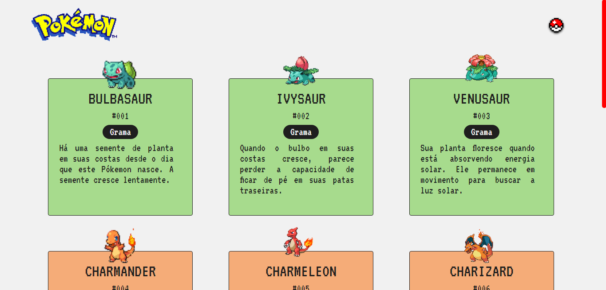

<h1 align="center"> Listagem de Pokémons </h1>

Listagem de pokémons desenvolvida durante a Semana do Zero ao Programador Contratado, imersão do Dev em Dobro  

  <a href="#-tecnologias">Tecnologias</a>&nbsp;&nbsp;&nbsp;|&nbsp;&nbsp;&nbsp;
  <a href="#-deploy">Deploy</a>&nbsp;&nbsp;&nbsp;|&nbsp;&nbsp;&nbsp;
  <a href="#-english-version">English Version</a>&nbsp;&nbsp;&nbsp;&nbsp;&nbsp;&nbsp;

  

## 🚀 Tecnologias

Esse projeto foi desenvolvido com as seguintes tecnologias:

- HTML e CSS
- JavaScript
- Git e Github

## 💻 Deploy

> [Clique aqui para navegar para o projeto!](https://ssschneider.github.io/listagem-pokemons-devweek/)

## 🌎 English Version

Pokémon List is a project developed during the Programmer Week: From Zero to Hired an immersion offered by Dev em Dobro. To do that, I've used:
- HTML, CSS, JS, Git and Github

> You can check out the deploy by [clicking here](https://ssschneider.github.io/listagem-pokemons-devweek/)

---
### Desenvolvido por Sarah Schneider 🖖